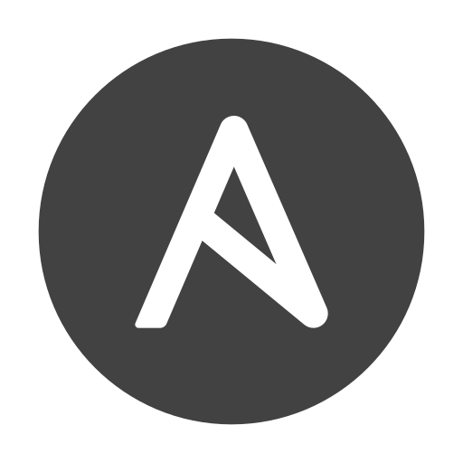

## Hi there 👋

## 🚀 About Me

I am a dedicated Monitoring Specialist with a strong background in customer administration. My experience enables me to
deliver reliable process oversight and customer-oriented solutions, bringing valuable technical support and efficiency
to software development.

## 💻 Skills & Expertise

### Coding Languages:

| Language   |                                                       | Language   |                                                       | Language |                                                   |
|------------|-------------------------------------------------------|------------|-------------------------------------------------------|----------|---------------------------------------------------|
| Python     |      | Shell      |       | PHP      |     |
| JavaScript |  | PowerShell |  | Kotlin   |  |
| TypeScript |  | Java       |        | Perl     |    |
| CSS        |         | Arduino    |     |          |                                                   |
| HTML       |        | C          |           |          |                                                   |
| SQL        |         | Lua        |         |          |                                                   |
| Shell      |       | AutoHotKey |  |          |                                                   |

### Tools & Technologies:

| Category           | Tools                                                                                                                                                                                                                                                                                                                                                           |
|--------------------|-----------------------------------------------------------------------------------------------------------------------------------------------------------------------------------------------------------------------------------------------------------------------------------------------------------------------------------------------------------------|
| Development        | Blender  / GIMP                                                                                                                                                                                                                                                |
| Automation         | Ansible  / Terraform                                                                                                                                                                                                                                      |
| Operating Systems  | Linux  (Debian  + Debian  + Fedora ) MacOS  Windows  |
| Hardware           | Mikrotik  / Aruba                                                                                                                                                                                                                                            |
| Virtualization     | Proxmox  / Kubernetes  / Docker                                                                                                                                                                         |
| Monitoring Systems | Centreon  / Nagios  / Grafana  / CheckMK                                                                                                                |

## 💼 Work Experience

### Thüringer Landesrechenzentrum (**IT- Systembetreuer Landesverfahren**):

- Administration and monitoring of critical IT systems for state government applications.
- Automate routine tasks with Ansible and Terraform to enhance operational efficiency and reduce manual intervention.
- Support 

### Freelance Projects (**Various Roles**):

- **Developer:** Tool for data collection and analysis for monitoring water quality in dam infrastructure.
- **System Administrator:** Managed and optimized IT infrastructure for small businesses, ensuring system reliability and security.
- **Technical Support Specialist:** Provided remote technical support and troubleshooting for clients, enhancing user satisfaction and system performance.

### Kirchhoff Datensysteme (**System Administrator / Software Engineer**):

- Provided technical support, developed automated utilities, and deployed monitoring solutions to enhance system reliability.
- Managed customer systems, ensuring optimal performance and security.

